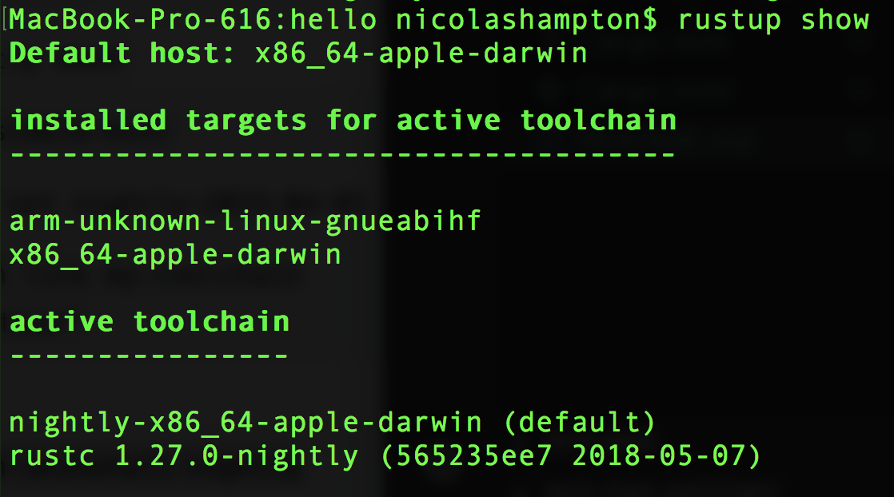
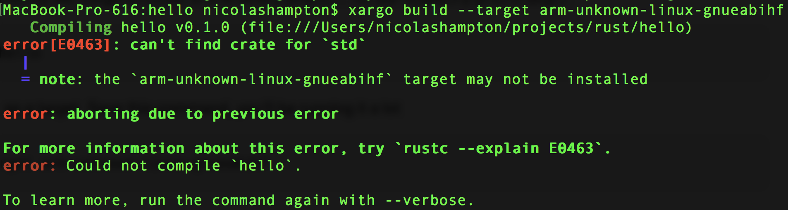

# Bare Metal OS Development on Raspberry Pi Zero W

## Toolchain setup

The absolute best way to install rust is with rustup

```bash
curl https://sh.rustup.rs -sSf | sh
```

Then you'll need to get the nightly toolchain and the target for 
cross-compiling to the ARM6 processor in the Raspberry Pi. 
Fortunately, Rustup makes this dead-easy as long as you know what the
target-triple is. In the case of Raspberry Pi Zero's and Raspberry 
Pi 1, it's arm-unknown-linux-gnueabihf.

```bash
rustup install nightly
rustup target add arm-unknown-linux-gnueabihf
```

To confirm, the results of rustup show should look like this at this 
point:



xargo is what we'll use instead of xargo as a build tool. xargo is 
almost the same as cargo, but also builds the correct sysroot 
directory that our raspberry pi will need.

```bash
cargo install xargo
```

xargo can be used to exactly like cargo to create a new binary 
project... for our raspberry pi as a target.

```bash
xargo new --bin hello
cd hello
```

and compile for our pi as a target. Save this command, you'll be 
running it a lot

```bash
xargo build --target arm-unknown-linux-gnueabihf
```

At this point, you're going to reach the first error that you should 
expect.



This looks like you've missed installing the target, and indeed, I 
spent several days thinking that while looking for what I missed. 
However, that's not what's happening. The compiler is just looking 
for the standard library, and we're not including one. We've 
successfully installed our toolchain. It's time to look at the source 
code xargo generated in `./hello/src/main.rs`

```rust
fn main() {
    println!("Hello, world!");
}
```

We need to tell the compiler 

```rust
#![no_std]

fn main() {}
```

At this point, there's a much better resource for us to refer to. 


